# 🎵 Music Recommender Simulation

## Project Summary

In this project you will build and explain a small music recommender system.

Your goal is to:

- Represent songs and a user "taste profile" as data
- Design a scoring rule that turns that data into recommendations
- Evaluate what your system gets right and wrong
- Reflect on how this mirrors real world AI recommenders

This simulation builds a content-based music recommender that scores songs from a small catalog against a user's taste profile. Unlike real-world platforms (Spotify, YouTube) that combine collaborative filtering — learning from millions of users' behavior — with audio analysis, this version focuses entirely on song attributes: genre, mood, energy, valence, and acousticness. Each song receives a weighted similarity score against the user's preferences, and the top-k highest-scoring songs are returned as recommendations with a plain-language explanation of why each one matched.

---

## How The System Works

Real-world recommenders like Spotify combine two strategies: **collaborative filtering** (finding users with similar taste and recommending what they loved) and **content-based filtering** (matching a song's audio attributes to a user's preference profile). Collaborative filtering is powerful but requires massive behavioral data and fails for new users or new songs. This simulation prioritizes the content-based approach — it is transparent, explainable, and works from song attributes alone, making it ideal for understanding the core mechanics of recommendation without needing user history.

This system scores every song in the catalog against the user's taste profile using a weighted formula, then ranks all songs by score and returns the top-k results.

### `Song` Features

| Feature                 | Type           | Role in Scoring                                  |
| ----------------------- | -------------- | ------------------------------------------------ |
| `genre`                 | categorical    | Primary taste signal — weighted 30%              |
| `mood`                  | categorical    | Listening context signal — weighted 25%          |
| `energy`                | float (0–1)    | Proximity to user's target energy — weighted 20% |
| `valence`               | float (0–1)    | Emotional tone (happy vs. dark) — weighted 15%   |
| `acousticness`          | float (0–1)    | Organic vs. electronic texture — weighted 10%    |
| `tempo_bpm`             | float (60–152) | Normalized and used as supporting signal         |
| `danceability`          | float (0–1)    | Supporting signal for rhythm preference          |
| `title`, `artist`, `id` | string/int     | Display and identification only                  |

### `UserProfile` Fields

| Field                 | Type        | What It Captures                                      |
| --------------------- | ----------- | ----------------------------------------------------- |
| `favorite_genre`      | string      | Hard preference — matched exactly against song genre  |
| `favorite_mood`       | string      | Listening context — matched exactly against song mood |
| `target_energy`       | float (0–1) | Desired intensity level — scored by proximity         |
| `target_valence`      | float (0–1) | Emotional brightness — scored by proximity            |
| `target_acousticness` | float (0–1) | Texture preference — scored by proximity              |

### Data Flow

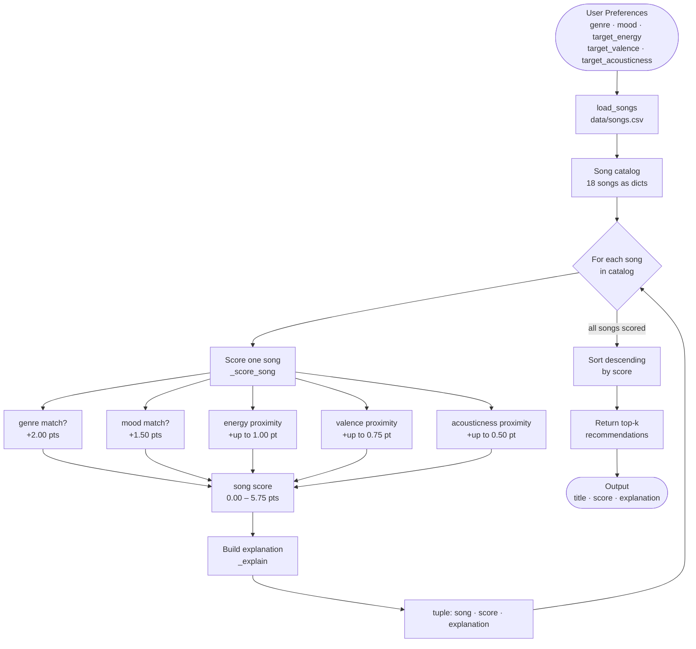

### Scoring Formula

```
score  =  2.00  ×  (genre == user.genre)
       +  1.50  ×  (mood  == user.mood)
       +  1.00  ×  (1 - |target_energy       - song.energy|)
       +  0.75  ×  (1 - |target_valence      - song.valence|)
       +  0.50  ×  (1 - |target_acousticness - song.acousticness|)

max possible score = 5.75
```

### Algorithm Recipe (Finalized)

The full decision process for producing a recommendation:

1. **Load** — Read `data/songs.csv` into a list of 18 song dicts, casting all numeric fields to `float`.
2. **Profile** — Accept a `user_prefs` dict with five keys: `genre`, `mood`, `target_energy`, `target_valence`, `target_acousticness`.
3. **Score every song** — For each song, compute a score out of 5.75 using the formula above. Categorical fields (genre, mood) use exact string matching for binary points. Numeric fields use inverse absolute difference so closeness — not raw magnitude — is rewarded.
4. **Explain** — For each song, generate a plain-language sentence identifying which features drove the match (e.g., genre/mood hit, energy proximity).
5. **Rank** — Sort all `(song, score, explanation)` tuples by score descending. Ties are broken by catalog order (`song["id"]`).
6. **Return** — Slice the sorted list to the top-k results and print them.

### Potential Biases to Watch For

- **Genre dominance** — Genre carries 2.00 of 5.75 possible points (35%). A song with a perfect genre match but mediocre numeric features will almost always outrank a song with no genre match but excellent energy, valence, and acousticness alignment. Great songs in unexpected genres are systematically buried.

- **Mood lock-in** — Mood adds another 1.50 points (26%). Together, genre + mood account for 61% of the maximum score. Any user profile whose genre or mood has fewer than 2–3 catalog entries will see those features dominate the results regardless of audio similarity.

- **Catalog representation gap** — The 18-song catalog has 13 genres but uneven depth: pop has 2 entries, lofi has 3, while metal, reggae, classical, and country each have only 1. A user who prefers metal can only ever get 1 genre-match point across the entire catalog, while a pop user can earn it on 2 songs.

- **Cold-start user problem** — The system has no fallback for a user whose stated genre or mood does not appear in the catalog at all (e.g., `genre = "bossa nova"`). Both categorical scores collapse to 0.00 and the system degrades to ranking purely by numeric similarity — which it will do silently, with no warning.

- **Binary categorical scoring** — Genre and mood are all-or-nothing. There is no partial credit for related genres (e.g., "indie pop" vs "pop" scores the same as "metal" vs "pop" — both 0). A more sophisticated system would use genre-similarity embeddings to award partial points for close genres.

---

## Getting Started

### Setup

1. Create a virtual environment (optional but recommended):

   ```bash
   python -m venv .venv
   source .venv/bin/activate      # Mac or Linux
   .venv\Scripts\activate         # Windows

   ```

2. Install dependencies

```bash
pip install -r requirements.txt
```

3. Run the app:

```bash
python -m src.main
```

### Sample Terminal Output

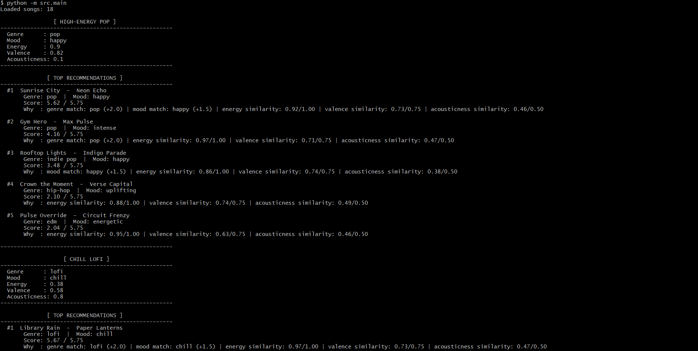
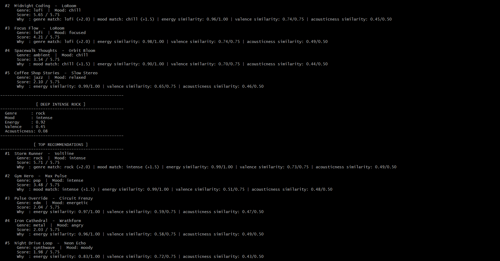
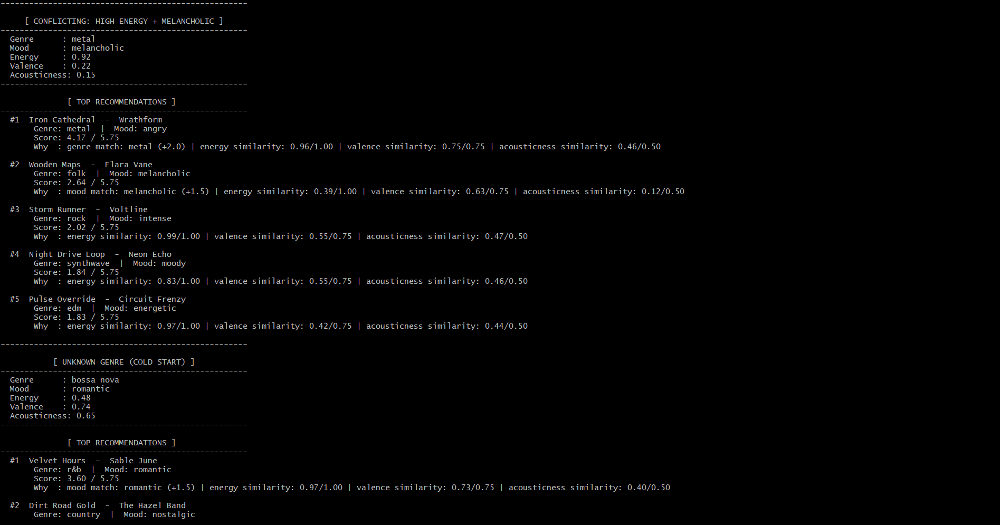
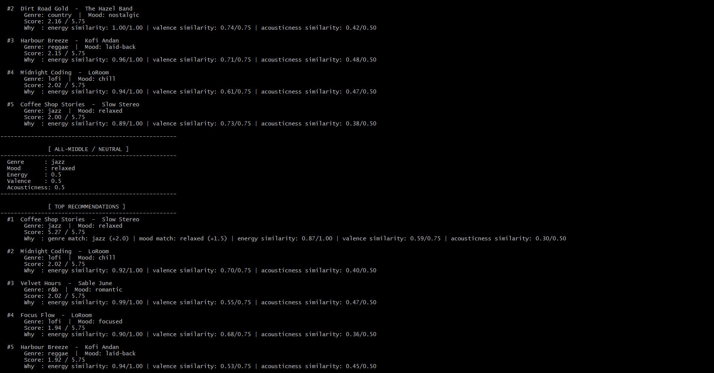

### Stress Test — All Profiles (Phase 4)

Six profiles were run to evaluate correctness and expose edge cases.

#### Profile 1 — High-Energy Pop

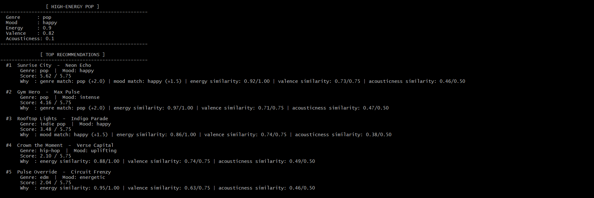

> Expected: pop/happy songs first. Correct. Gym Hero (pop, intense) ranks #2 over Rooftop Lights (indie pop, happy) because genre weight (2.0) beats mood weight (1.5).

#### Profile 2 — Chill Lofi

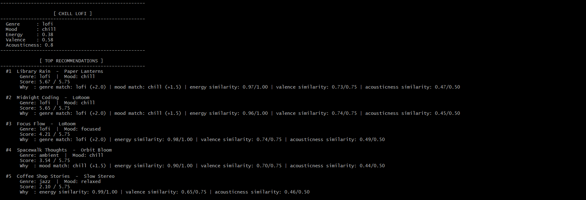

> Expected: lofi/chill songs. Correct. #3 is lofi but "focused" not "chill" — costs the 1.5 mood points. #4 is ambient/chill — mood match rescues it above jazz at #5.

#### Profile 3 — Deep Intense Rock

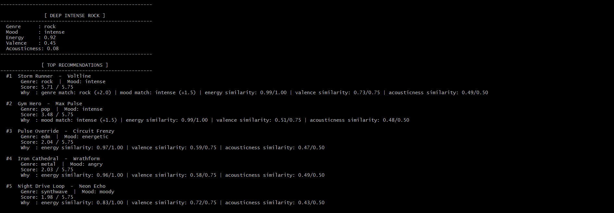

> Expected: Storm Runner is the only rock/intense song — scores near-perfect 5.71. Large gap to #2 (3.48) confirms genre+mood dominance. Iron Cathedral and Pulse Override compete on energy proximity alone.

#### Profile 4 — Adversarial: High Energy + Melancholic (Conflicting)

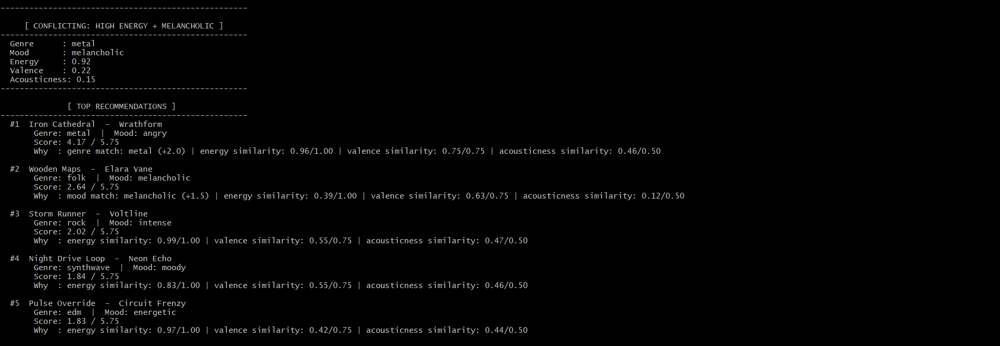

> Bias exposed: Iron Cathedral (metal/angry) scores 4.17 on genre match alone — but the user wanted "melancholic", not "angry". Wooden Maps (folk/melancholic) gets #2 via mood match despite being a quiet acoustic track with energy 0.31 vs user target 0.92. The system cannot reconcile conflicting preferences — it rewards each dimension independently.

#### Profile 5 — Adversarial: Unknown Genre (Cold Start)

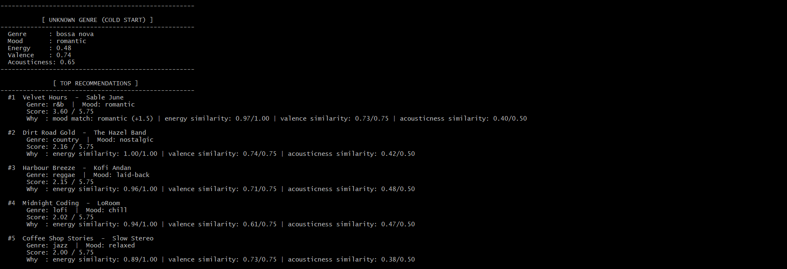

> Cold start confirmed: "bossa nova" is not in the catalog — genre scores 0 for all 18 songs. Velvet Hours wins via mood match (romantic) + near-perfect energy proximity. #2–#5 are separated by less than 0.16 points, showing the system has very low confidence when forced to rank on numerics alone.

#### Profile 6 — Adversarial: All-Middle / Neutral

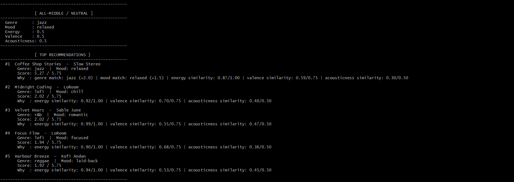

> #1 dominates (5.27) via genre+mood match on a catalog with only 1 jazz song. #2–#5 cluster tightly (2.02–1.92) — the 0.5 midpoint means all songs score roughly equal on numeric features, leaving catalog order as the practical tiebreaker.

---

### Running Tests

Run the starter tests with:

```bash
pytest
```

You can add more tests in `tests/test_recommender.py`.

---

## Experiments You Tried

- Halved the genre weight (2.0 -> 1.0) and doubled the energy weight (1.0 → 2.0) - Rooftop Lights moved above Gym Hero for the pop/happy user, which felt more accurate since it matched the mood better
- Ran a "bossa nova" cold start profile where the genre wasn't in the catalog - the top 4 results were within 0.16 points of each other, showing the system loses confidence without a genre match
- Tested an all-neutral profile with every preference at 0.5 - Coffee Shop Stories dominated purely because it was the only jazz/relaxed song, not because it was the best overall fit

---

## Limitations and Risks

- It works only on 18 songs - results are predictable for most genres since there's just one song per genre
- Does not understand lyrics or what a song actually sounds like - it only compares numbers
- Genre matching is all-or-nothing - "indie pop" and "metal" are penalized the same against a "pop" user
- Cannot detect conflicting preferences - a user wanting high energy and a melancholic mood gets confusing results

---

## Reflection

[**Model Card**](model_card.md)

Building this app made me realize that every recommendation is just math shaped by whoever decided what the numbers should mean. The genre weight being too strong wasn't obvious from reading the code - it only showed up when I tested edge cases. Real apps like Spotify have the same tradeoffs, just with learned weights instead of hand-picked ones.
